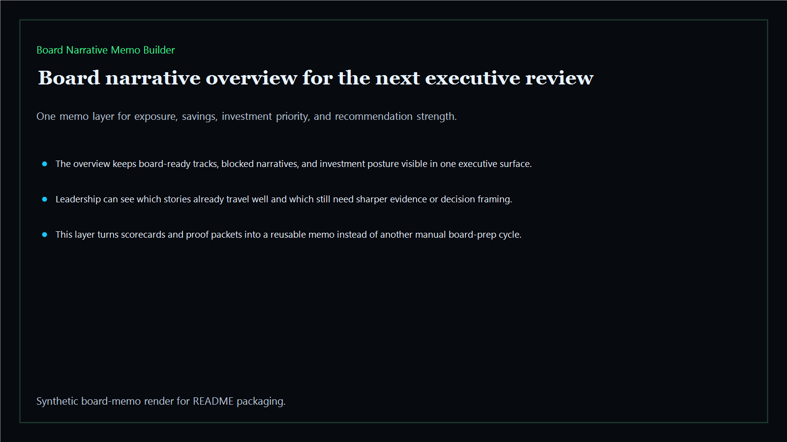
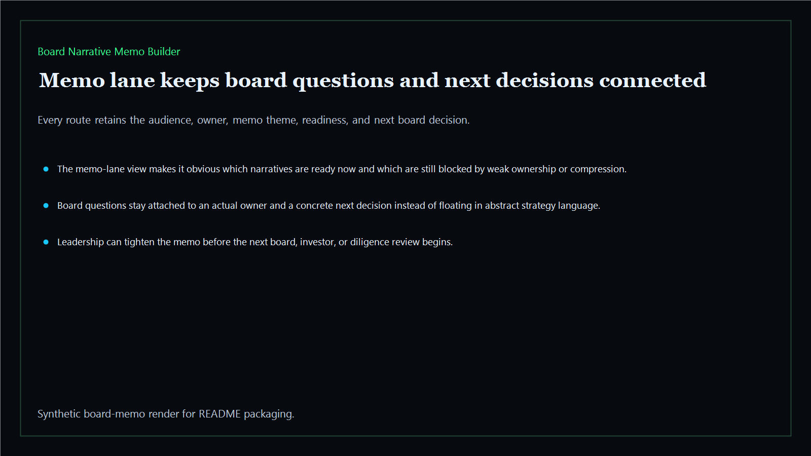
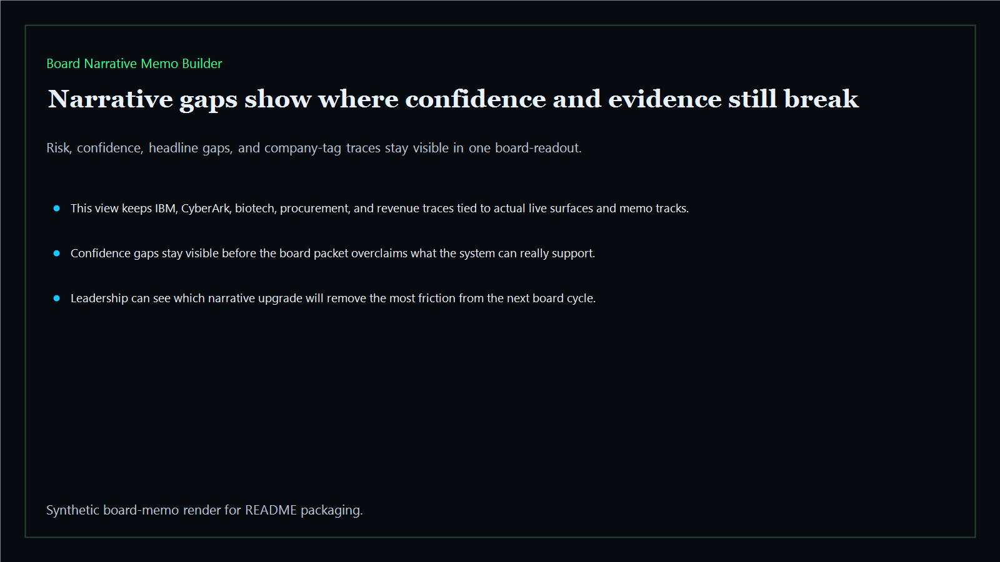
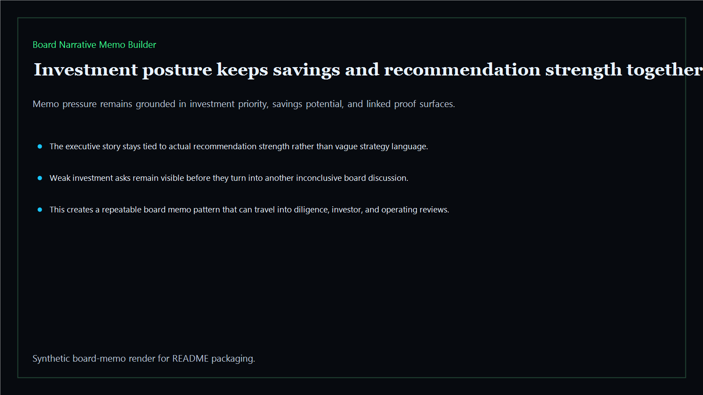

# Board Narrative Memo Builder

Board-ready intelligence layer that turns scorecards, proof packets, and executive findings into one reusable memo for boards, investors, and operating reviews.

- Live: `https://memo.kineticgain.com/`
- Repo: `mizcausevic-dev/board-narrative-memo-builder`

## Why this matters

The strongest executive-intelligence products still need one last layer: a memo that says where the risk sits, where savings can be realized, where investment should go next, and what story leadership can defend in the room. This repo packages that final compression layer.

## What it includes

- TypeScript memo surface with narrative scoring and board-oriented routes
- synthetic executive tracks across AI, identity, revenue, FinTech, biotech, procurement, and public-sector posture
- reusable board outputs for exposure, savings, investment priority, and confidence
- prerendered static site, JSON payloads, screenshots, and docs

## Routes

- `/`
- `/memo-lane`
- `/narrative-gaps`
- `/investment-posture`
- `/verification`
- `/docs`

## Local run

```bash
cd board-narrative-memo-builder
npm install
npm run verify
npm run prerender
npm run render:assets
```

## CLI

```bash
npx board-narrative-memo-builder fixtures/board-narrative-memo-builder.json --format summary
npx board-narrative-memo-builder fixtures/board-narrative-memo-builder-clean.json --format json
```

## Docs

- [Architecture](docs/architecture.md)
- [Origin](docs/ORIGIN.md)
- [Kinetic Gain Embedded](docs/KINETIC_GAIN_EMBEDDED.md)

## Screenshots





